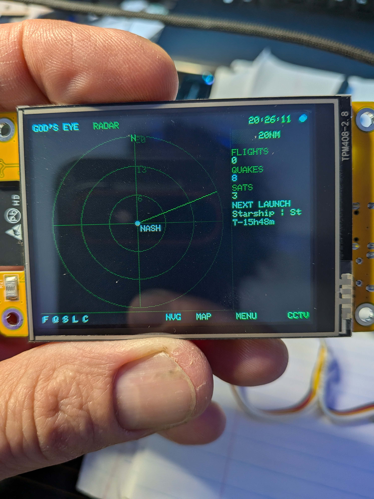

<div align="center">

# 🌐 God's Eye CYD

### Live open-source spatial intelligence on a $10 screen.

A native ESP32 firmware that brings the spirit of **[God's Eye View](https://github.com/bilawalsidhu/gods-eye-view)** to the **Cheap Yellow Display** — live aircraft, earthquakes, satellites, rocket launches, a pannable world satellite map, and public webcams, all on a 2.8" touchscreen. No API keys. Set up from your phone.




-FFCC00)


</div>

---

## About

The original **God's Eye View** is a photorealistic 3D globe (CesiumJS + WebGL + Google 3D Tiles) that needs a real GPU and gigabytes of RAM. A Cheap Yellow Display has a 240 MHz ESP32, ~520 KB of RAM, no PSRAM, and no GPU — so a 3D globe is off the table.

**God's Eye CYD** is not a port of the *renderer* — it's a port of the *idea*. It pulls the same kind of keyless, public OSINT feeds over WiFi and renders them natively on the CYD as a **north-up tactical radar (PPI)**, a **2D satellite map you can fly anywhere on Earth**, and a **live public-webcam viewer** — with sensor-style "optics" (NVG, FLIR, amber tactical) for the full spy-thriller feel. It's flash-and-go: WiFi and location are configured on-device from your phone at first boot, and everything persists in flash.

> ⚠️ Exploratory visualization of public data. **Not for navigation, aviation, emergency, or any safety-critical use.** Data may be delayed, modeled, or wrong.

---

## Table of Contents

- [Features](#features)
- [Data sources](#data-sources)
- [Hardware](#hardware)
- [Quick start](#quick-start)
- [First boot](#first-boot)
- [Controls](#controls)
- [Configuration](#configuration)
- [Troubleshooting](#troubleshooting)
- [Architecture](#architecture)
- [Roadmap](#roadmap)
- [Credits](#credits)
- [License](#license)

---

## Features

| | Feature | Details |
|---|---|---|
| 🎯 | **Tactical PPI radar** | North-up plan-position display centered on your location, 3 range rings, tap the chip to cycle 20 → 250 NM. Tap any blip for a live telemetry card. |
| ✈️ | **Live flights** | Real-time ADS-B. Heading-aligned aircraft glyphs, military traffic highlighted. Tap one for a full ID card — callsign, **registration (tail #)**, **aircraft type**, ICAO hex, altitude, ground speed, track, and range. Selection stays locked to that aircraft across refreshes. |
| 🌍 | **Earthquakes** | USGS global feed, sized by magnitude, tap for depth + location. |
| 🛰️ | **Satellites** | On-device **SGP4** propagation from live CelesTrak TLEs (ISS, Hubble, NOAA-19 by default). Plots the sub-satellite point as it passes over your scope. |
| 🚀 | **Rocket launches** | Upcoming launches with a live T-minus countdown in the panel. |
| 🗺️ | **Satellite MAP mode** | Pan/zoom **satellite imagery of anywhere on Earth** (Esri World Imagery) with **live aircraft overlaid**. Tap to recenter, ± to zoom, HOME to return. |
| 📹 | **CCTV** | Scrollable list of **public MJPEG webcams** worldwide (ski, ports, airports, cities) streamed **live** on-device. |
| 🎨 | **Sensor optics** | NORMAL / NVG (night vision) / FLIR ironbow / AMBER tactical palettes. |
| 📱 | **Phone setup** | First-boot captive portal for WiFi + location — no file editing, no keys. Everything saved to flash (NVS). |

---

## Data sources

Every layer is **keyless**. Nothing here requires an account, token, or payment.

| Layer | Source | Notes |
|---|---|---|
| Flights | [adsb.fi](https://adsb.fi) (primary) · [adsb.lol](https://adsb.lol) | Community ADS-B aggregators |
| Earthquakes | [USGS](https://earthquake.usgs.gov) | M4.5+ / 24 h GeoJSON (adjustable) |
| Satellites | [CelesTrak](https://celestrak.org) TLEs + **SGP4** (Hopperpop) | Propagated on-device |
| Launches | [Launch Library 2](https://thespacedevs.com) | Free tier, polled every 30 min |
| Map imagery | **Esri World Imagery** | Web Mercator tiles |
| Geocoding | [Open-Meteo](https://open-meteo.com) | City name → lat/lon |
| CCTV | Public MJPEG webcams | List in `cctv_list.h` |

---

## Hardware

- **ESP32-2432S028** "Cheap Yellow Display" — 2.8" 240×320 TFT + resistive touch.
  - The **2-USB** variant (micro-USB + USB-C) typically ships with an **ST7789** panel (the default here); the classic 1-USB variant uses **ILI9341**. Both are supported — one line in `User_Setup.h`.
- A 2.4 GHz WiFi network (the ESP32 has no 5 GHz radio).
- A good USB **data** cable / stable 5V supply (WiFi streaming is current-hungry — weak power causes glitches).

No SD card and no PSRAM required.

---

## Quick start

### 1. Install libraries (Arduino Library Manager)

| Library | Author |
|---|---|
| TFT_eSPI | Bodmer |
| TJpg_Decoder | Bodmer |
| XPT2046_Touchscreen | PaulStoffregen |
| ArduinoJson **(v7.x)** | Benoît Blanchon |
| WiFiManager | tzapu |
| Sgp4 | Hopperpop *(the `SparkFun_SGP4_Arduino_Library` is the same code and also works)* |

Boards: install **esp32 by Espressif Systems** (Boards Manager). Select **ESP32 Dev Module**, and set **Tools → Partition Scheme → Huge APP**.

### 2. Install the display config

TFT_eSPI is configured at **compile time**, so copy the included setup over the library's default:

```
<your Arduino folder>/libraries/TFT_eSPI/User_Setup.h   ←  replace with this repo's User_Setup.h
```

It defaults to **ST7789 @ 40 MHz**. On boot you'll see **R / G / B color bars** — a self-test:
- Blank/white screen → wrong driver: switch to ILI9341 in `User_Setup.h`.
- Photo-negative colors → uncomment `TFT_INVERSION_ON`.
- Red/blue swapped → change `TFT_RGB_ORDER` to `TFT_RGB`.

### 3. Flash

Open `GodsEyeCYD.ino`, select your board/port, and upload. **No file editing needed** — WiFi and location are set on-device.

---

## First boot

Settings persist in the ESP32's flash (NVS) — configured once, from your phone:

1. On first power-up (or whenever it can't reach the saved network), the device broadcasts a WiFi hotspot **`GodsEye-Setup`**; the screen shows join instructions.
2. Join it from your phone — a setup page opens automatically (or browse to `192.168.4.1`).
3. Pick your WiFi, enter the password, and type a **Home location** (e.g. `Nashville, TN` or `Berlin, DE`).
4. Save. It connects, geocodes the city once, centers the radar there, and remembers everything.

Every boot after auto-reconnects silently. **To re-configure:** hold **BOOT** at power-on, or tap **SETUP** in the on-screen menu.

---

## Controls

**Radar**
- **Tap a blip** → telemetry card. Tap empty scope to deselect.
- **Range chip** (top-right) → cycle range.
- **Tap F Q S L C** (bottom-left) → toggle a layer on/off directly (Flights, Quakes, Sats, Launches, CCTV). Lit = on.
- Bottom bar: **MAP** · **MENU** · **CCTV**.
- Link dot (top-right) / green LED → a feed refreshed in the last 20 s.

**Menu** — toggle layers, cycle **OPTIC** (palette), **SETUP** (re-open portal), current HOME shown at the bottom.

**MAP** — tap to recenter, **− / +** zoom, **GO** to type any latitude/longitude and jump there, **HOME** to your location, **BACK** to radar. (You can also reach anywhere on Earth by zooming out, tapping a region, and zooming back in.)

**CCTV** — scroll the list (**UP/DOWN**), tap a camera to stream; while playing, tap image or **NEXT** to skip, **PREV** back, **BACK** to the list.

---

## Configuration

Everything works out of the box; `config.h` holds optional tunables:

- Default layer on/off, poll intervals, radar range steps, boot optic/theme.
- `SAT_CATNRS[]` — NORAD catalog numbers to track.
- `FLIGHTS_QUERY_NM` — ADS-B search radius.
- Fallback home location (used only before you set one via the portal).

Cameras live in **`cctv_list.h`** (`{ "Label", "http://host:port/path" }`). Add your own — must be **`http://` MJPEG** streams (`/mjpg/video.mjpg` or `/axis-cgi/mjpg/video.cgi` style); HLS/RTSP won't work.

---

## Troubleshooting

| Symptom | Fix |
|---|---|
| Blank / white screen | Wrong display driver — switch ST7789 ↔ ILI9341 in `User_Setup.h`. |
| Negative or swapped colors | Toggle `TFT_INVERSION_ON` / `TFT_RGB_ORDER` in `User_Setup.h`. |
| Screen glitches after running a while | Lower `SPI_FREQUENCY` (already 40 MHz); use a better USB **data** cable / stronger 5V. |
| Upload fails ("Failed to connect") | Lower **Upload Speed** to 115200; hold **BOOT** during upload; try the other USB port. |
| Flights stay at 0 | Panel shows a diagnostic — `okN` = working, `errNNN` = HTTP error from the feed. Try again or switch source in `layers.h`. |
| Touch doesn't register | Tune `TS_MINX/MAXX/MINY/MAXY` at the top of `ui.h`. |
| A camera shows "offline" | Public cams come and go — just skip to the next. |

---

## Architecture

Vanilla Arduino/C++, one screen at a time, one network fetch at a time (no PSRAM → keep peak heap low).

```
GodsEyeCYD.ino   main: globals, HW init, boot self-test, scheduler, touch, loop
config.h         optional tunables (defaults; no editing required)
User_Setup.h     TFT_eSPI display config → copy into the TFT_eSPI library folder
app_state.h      shared structs + globals (runtime home location, UI state)
net.h            WiFi reconnect + TLS JSON / text / binary fetch helpers
prefs.h          NVS persistence (location, theme, range, layers)
provision.h      WiFiManager captive portal + Open-Meteo geocoding
geo.h            haversine range/bearing + north-up PPI projection
theme.h          the four optic palettes
layers.h         flights / quakes / satellites (SGP4) / launches pollers
cctv.h           CCTV: scrollable list + live MJPEG-over-HTTP viewer
cctv_list.h      bundled worldwide public-webcam list (edit to taste)
mapview.h        satellite MAP mode (Esri tiles + flight overlay, pan/zoom)
ui.h             radar, HUD, telemetry, menu, touch mapping
```

**Design notes**
- Feeds poll on a **rotating schedule** — one TLS request in flight at a time keeps peak heap safe without PSRAM.
- Satellites propagate locally via **SGP4**; TLEs refresh every 6 h.
- A selected aircraft is locked by its ICAO **hex**, so it stays selected on the same plane as the list refreshes (not by list position).

---

## Roadmap

- [x] Tappable **F Q S L C** layer toggles on the radar bar
- [x] Match tracked aircraft by ICAO hex across refreshes (stable selection)
- [ ] Move polling to a FreeRTOS task (core 0) so fetches never touch the UI
- [x] On-screen keypad to jump to any latitude/longitude in MAP mode
- [ ] On-screen keyboard for city-name search (geocoded) in MAP mode
- [ ] Fetch the CCTV list at runtime instead of bundling it
- [ ] Tile caching for smoother MAP panning

Contributions welcome — open an issue or PR.

---

## Credits

- **God's Eye View** by **[Bilawal Sidhu](https://github.com/bilawalsidhu)** & **Sameh Khamis** ([Halfpixel](https://halfpixel.ai)) — the original open-source live-OSINT globe that inspired this project. This firmware is an independent, hardware-scaled reimagining of that idea for the ESP32; the concept and the "spatial intelligence for everyone" spirit are theirs. → <https://github.com/bilawalsidhu/gods-eye-view> (MIT)
- **CCTV viewer & camera list** adapted from **[7h30th3r0n3](https://github.com/7h30th3r0n3)**'s **RaspyJack** — the MJPEG-over-HTTP frame-grabbing approach and the public-webcam list. → <https://github.com/7h30th3r0n3/Raspyjack>
- **Libraries:** TFT_eSPI & TJpg_Decoder (*Bodmer*), XPT2046_Touchscreen (*PaulStoffregen*), ArduinoJson (*Benoît Blanchon*), WiFiManager (*tzapu*), Sgp4 (*Hopperpop*).
- **Data & imagery:** adsb.fi · adsb.lol · USGS · CelesTrak · The Space Devs · Open-Meteo · Esri World Imagery.

Built by **[Kul3y3-Thric3](https://github.com/Kul3y3-Thric3)**.

---

## License

Released under the **MIT License** — see [`LICENSE`](LICENSE).

Bundled and live data/imagery are provided by third parties under their own terms of use; respect them. The bundled public webcams are third-party feeds that appear and disappear without notice.

<div align="center">

**🌐 God's Eye CYD — no place left behind.**

</div>
